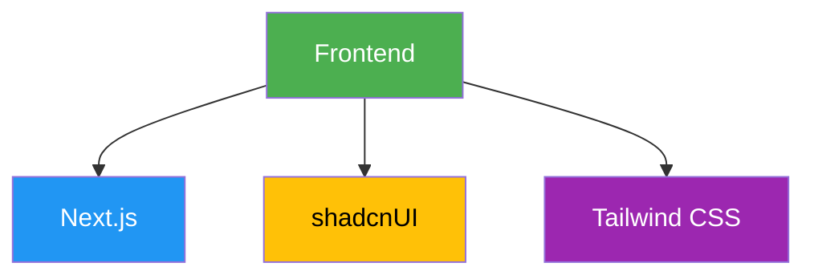
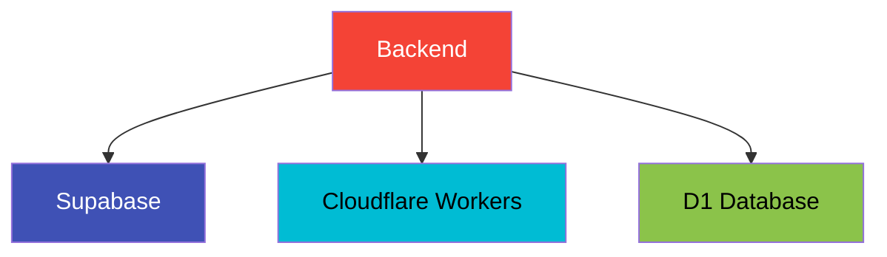
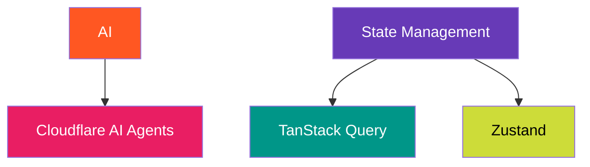
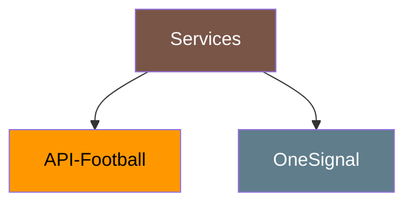

Frontend Tech Stack Diagram:

```mermaid
graph TD
    A[Frontend]:::frontend --> B[Next.js]:::framework
    A --> C[shadcnUI]:::ui
    A --> D[Tailwind CSS]:::styling
    
    classDef frontend fill:#4CAF50,color:white
    classDef framework fill:#2196F3,color:white
    classDef ui fill:#FFC107,color:black
    classDef styling fill:#9C27B0,color:white
```

Backend Tech Stack Diagram:

```mermaid
graph TD
    E[Backend]:::backend --> F[Supabase]:::database
    E --> G[Cloudflare Workers]:::serverless
    E --> H[D1 Database]:::storage
    
    classDef backend fill:#F44336,color:white
    classDef database fill:#3F51B5,color:white
    classDef serverless fill:#00BCD4,color:black
    classDef storage fill:#8BC34A,color:black
```

AI & State Management Diagram:

```mermaid
graph TD
    I[AI]:::ai --> J[Cloudflare AI Agents]:::ml
    K[State Management]:::state --> L[TanStack Query]:::remote
    K --> M[Zustand]:::local
    
    classDef ai fill:#FF5722,color:white
    classDef ml fill:#E91E63,color:white
    classDef state fill:#673AB7,color:white
    classDef remote fill:#009688,color:white
    classDef local fill:#CDDC39,color:black
```

Services Diagram:

```mermaid
graph TD
    N[Services]:::services --> O[API-Football]:::sports
    N --> P[OneSignal]:::notifications
    
    classDef services fill:#795548,color:white
    classDef sports fill:#FF9800,color:black
    classDef notifications fill:#607D8B,color:white
```